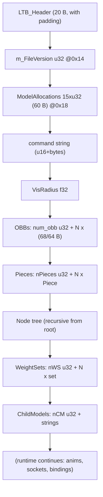

Here is the layout and offset tables for the `.ltb`. We need to separate two zones: a **fixed-size header** (calculable absolute offsets) and the **variable-size body** (relative offsets, dependent on string lengths, number of pieces, LODs, vertices, etc.).

## Fixed zone: header + version + ModelAllocations (84 bytes)

The engine reads the `LTB_Header` with `file.Read(&LTBHeader, sizeof(LTBHeader))`, meaning it dumps the C struct as-is, **with its padding**. [ model_load.cpp:786-787 ](./Engine/Engine/runtime/model/src/model_load.cpp#L786-L787) The struct has natural alignment (u16 at even offsets, u32 at multiples of 4), so it takes up 20 bytes with 4 bytes of padding. [ ltbhead.cpp:36-44 ](./Engine/Engine/tools/ltbhead/ltbhead.cpp#L36-L44) This is confirmed by the `loadLTB` reader, which explicitly does `skip(1)` after the fileType and `skip(1+3+12)` after the version. [ host_model.h:420-424 ](./Platform/host/host_model.h#L420-L424)

| Offset | Size | Type | Field           | Expected value                     |
| ------ | ---- | ---- | --------------- | ---------------------------------- |
| `0x00` | 1    | u8   | `m_iFileType`   | `1` = `LTB_D3D_MODEL_FILE`         |
| `0x01` | 1    | —    | padding         | —                                  |
| `0x02` | 2    | u16  | `m_iVersion`    | `9` (container version)            |
| `0x04` | 1    | u8   | `m_iReserved1`  | —                                  |
| `0x05` | 3    | —    | padding         | —                                  |
| `0x08` | 4    | u32  | `m_iReserved2`  | —                                  |
| `0x0C` | 4    | u32  | `m_iReserved3`  | —                                  |
| `0x10` | 4    | u32  | `m_iReserved4`  | —                                  |
| `0x14` | 4    | u32  | `m_FileVersion` | `>= 23` (`MIN_MODEL_FILE_VERSION`) |

Right after comes `ModelAllocations::Load`, which reads **15 × u32** in this exact order (60 bytes). 
[ modelallocations.cpp:42-61 ](./Engine/Engine/runtime/model/src/modelallocations.cpp#L42-L61) Note: the actual order differs from the comment I gave you before — `m_VertAnimDataSize` goes **before** `m_nAnimData`:

| Offset | Type | Field                | Meaning                      |
| ------ | ---- | -------------------- | ---------------------------- |
| `0x18` | u32  | `m_nKeyFrames`       | total animation keyframes    |
| `0x1C` | u32  | `m_nParentAnims`     | parent animations            |
| `0x20` | u32  | `m_nNodes`           | skeleton nodes               |
| `0x24` | u32  | `m_nPieces`          | pieces                       |
| `0x28` | u32  | `m_nChildModels`     | child models (includes SELF) |
| `0x2C` | u32  | `m_nTris`            | total triangles              |
| `0x30` | u32  | `m_nVerts`           | total vertices               |
| `0x34` | u32  | `m_nVertexWeights`   | skinning weights             |
| `0x38` | u32  | `m_nLODs`            | total LODs                   |
| `0x3C` | u32  | `m_nSockets`         | sockets                      |
| `0x40` | u32  | `m_nWeightSets`      | weight sets                  |
| `0x44` | u32  | `m_nStrings`         | number of strings            |
| `0x48` | u32  | `m_StringLengths`    | sum of string lengths        |
| `0x4C` | u32  | `m_VertAnimDataSize` | vertex-anim data size        |
| `0x50` | u32  | `m_nAnimData`        | anim block size              |

These values are NOT model data: they are used to pre-size the block allocator via `CalcAllocationSize`, which multiplies each counter by the `sizeof` the corresponding structure. [modelallocations.cpp:64-100](./Engine/Engine/runtime/model/src/modelallocations.cpp#L64-L100)

**End of the fixed zone: offset `0x54` (84 bytes).**

## Variable zone (relative offsets)

From `0x54` onwards, everything is variable length. Strings in LT format = `u16 len + char[len]` without null terminator. [host_model.h:90-98](./Platform/host/host_model.h#L90-L98) This is the order and layout, mirrored from `loadLTB`: [host_model.h:429-492](./Platform/host/host_model.h#L429-L492)

```
[command string]     u16 len + bytes
[m_VisRadius]        f32
[num_obb]            u32
  └ per OBB:         68 B (fileVersion>=24) | 64 B (deprecated)   × num_obb
[nPieces]            u32
  └ per PIECE:
      [name]         u16 len + bytes
      [nLODs]        u32
      [LOD dists]    f32 × nLODs
      [tmp min/max]  u32 + u32          (obsolete, ignored)
      └ per LOD:
          [nTex]           u32
          [texIdx[4]]      i32 × 4       (MAX_PIECE_TEXTURES)
          [renderStyle]    i32
          [priority]       u8
          [renderType]     u32           (4=rigid, 5=skel, 6=VA)
          [render object]  blob = u32 objSize + (objSize bytes)
          [usedNodeSize]   u8            ← INSIDE the LODs loop!
          [usedNodeList]   u8 × usedNodeSize
[node tree]          recursive (see below)
[nWeightSets]        u32
  └ per SET:         u16 len+bytes (name) + u32 nW + f32 × nW
[nChildModels]       u32               (>=1; index 0 = SELF, no string)
  └ per CHILD (1..): u16 len + bytes    (.ltb filename)
```
[host_model.h:429-492](./Platform/host/host_model.h#L429-L492)
[model_load.cpp:501-577](./Engine/Engine/runtime/model/src/model_load.cpp#L501-L577)

Details of the **render object blob** (inside each LOD). It starts with `u32 objSize` and the cursor always anchors to `blobStart + 4 + objSize`, which allows skipping unknown types. [host_model.h:245-248](./Platform/host/host_model.h#L245-L248) For type 4 (rigid) and 5 (skeletal), the blob starts with `vc, pc, mbt, mbv` (4 × u32) = vertex count, poly count, max bones/tri, max bones/vert: [host_model.h:250-256](./Platform/host/host_model.h#L250-L256)

```
[objSize]  u32
[vc]       u32   vertex count
[pc]       u32   poly count (indices = pc*3, each u16)
[mbt]      u32   max bones per tri
[mbv]      u32   max bones per vert
... (rigid: streamFlags[4] + boneEffector; skel: reindexed u8 + streamFlags[4] + useMP u8 + ...)
```

Each vertex within a stream has a `vsize` calculated by flags: `12 (POS) + nBlends*4 + (4 if indexed) + 12 (NORMAL 0x2) + 4 (DIFFUSE 0x4) + 4 (PSIZE 0x8) + uvFloats*4 + 36 (BASISVECTORS 0x100)`. [host_model.h:112-123](./Platform/host/host_model.h#L112-L123)

## Skeleton node (recursive format)

Each node, from the root: [host_model.h:440-463](./Platform/host/host_model.h#L440-L463)

| Field         | Type            | Notes                              |
| ------------- | --------------- | ---------------------------------- |
| name          | u16 len + bytes | —                                  |
| `m_NodeIndex` | u16             | (the engine reads `>>` — see note) |
| `m_Flags`     | u8              |                                    |
| global matrix | f32 × 16        | 4×4 row-major, bind pose           |
| `nChildren`   | u32             | recursive: N children follow       |

Note: the runtime `ModelNode::Load` uses `file >> m_NodeIndex` and `file >> m_Flags` on larger type members, while the reference reader `parseModelNode` treats them as `u16` (idx) and `u8` (flags). For a reliable byte-by-byte spec, I followed `parseModelNode`, which was validated against real files (HARMGuard, SnowMan). [host_model.h:212-216](./Platform/host/host_model.h#L212-L216)

## Block diagram


[model_load.cpp:822-972](./Engine/Engine/runtime/model/src/model_load.cpp#L822-L972)

[host_model.h:419-492](./Platform/host/host_model.h#L419-L492)

## Offset gotchas

- The `usedNodeListSize` (u8) is read **once per LOD**, inside the LODs loop, not once per piece. With 1 LOD the parsing error is masked; with 3 LODs it shifts by 6 bytes. [model_load.cpp:565-574](./Engine/Engine/runtime/model/src/model_load.cpp#L565-L574), [10-modelos-ltb-r3.md:15-18](./Docs-Claude-Muse/10-modelos-ltb-r3.md#L15-L18)
  
- The 2 × u32 after the LOD distances (min/max LOD offsets) are obsolete but still take up 8 bytes on disk. [model_load.cpp:524-527](./Engine/Engine/runtime/model/src/model_load.cpp#L524-L527)
  
- `m_nPieces` in `ModelAllocations` (`0x24`) may differ from the actual `nPieces` (e.g., `playerbase.ltb` declares pieces but brings 0 geometry); use the inline counter, not the one from allocations. [host_model.h:438-441](./Platform/host/host_model.h#L438-L441)
  
- `nChildModels` is always `>= 1`: index 0 is "SELF" and has NO associated string; only indices 1..N-1 write a filename. [model_load.cpp:947-972](./Engine/Engine/runtime/model/src/model_load.cpp#L947-L972)


